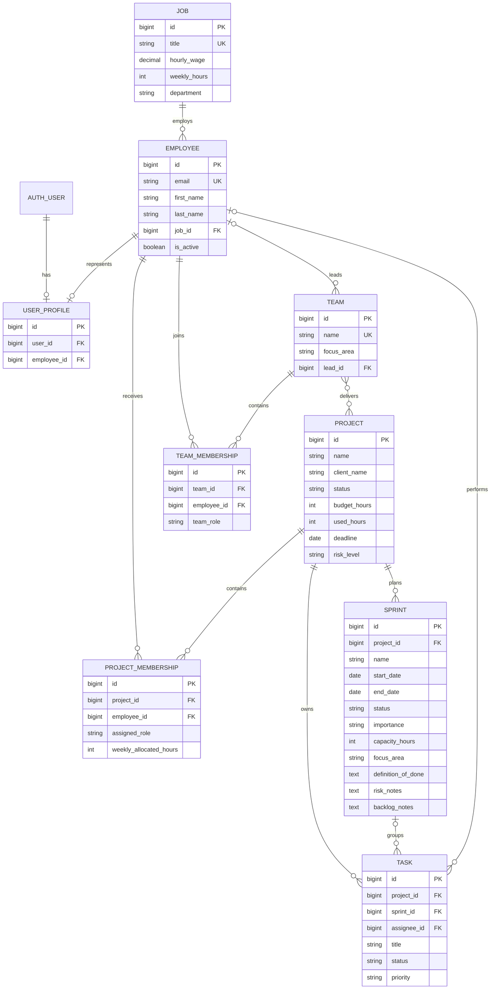

# TaaS Pulse — modello dati

Il database rappresenta persone, ruoli, squadre e lavoro di delivery. Le
tabelle intermedie non sono duplicazioni: memorizzano relazioni molti-a-molti
e, nel caso delle assegnazioni progetto, ruolo e capacità settimanale.

## Vincoli e cancellazioni

- email dipendente, titolo del job e nome del team sono univoci;
- una persona può comparire una sola volta nello stesso progetto o team;
- un nome sprint è unico all'interno del progetto;
- fine sprint non può precedere l'inizio;
- la capacità pianificata dello sprint deve essere positiva;
- ore e compensi non possono essere negativi;
- `Project` elimina in cascata sprint, task e membership;
- `Employee` è protetto finché il suo `Job` esiste, mentre la cancellazione
  dell'employee lascia nullo l'assegnatario dei task;
- la validazione API impedisce di assegnare task a sprint di un altro progetto
  o persone non appartenenti al progetto.
